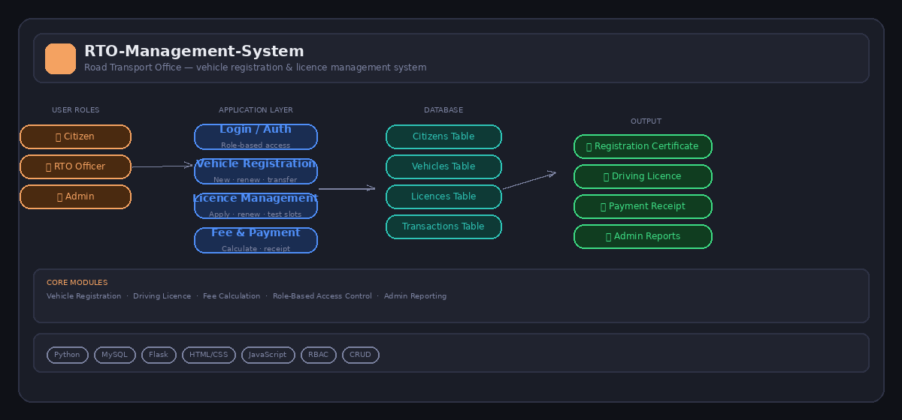

# 🚗 RTO Management System

> A full-stack web application that digitises and automates the operations of a Road Transport Office — covering vehicle registration, driving licence management, fee processing, and admin reporting with role-based access control.



---

## 📌 Project Overview

Road Transport Offices handle some of the most documentation-heavy processes in public administration — vehicle registrations, licence applications, renewals, transfers, and fee collection. In many regions, these processes are still paper-based, leading to long queues, lost records, and inefficient service delivery.

This project builds a **complete digital RTO management platform** that:
- Allows citizens to apply for vehicle registrations and driving licences online
- Enables RTO officers to process, approve, and manage applications
- Provides administrators with full oversight, reporting, and system control
- Automates fee calculations and generates official receipts and certificates
- Enforces role-based access control so each user type sees only what they need

The result is a clean, functional system that mirrors the kind of e-governance software deployed by transport authorities — demonstrating full-stack development, database design, and CRUD application skills.

---

## 🎯 Objectives

- Design and implement a relational database schema to store citizen, vehicle, licence, and transaction data
- Build a role-based login system with three distinct access levels: Citizen, RTO Officer, and Admin
- Develop core application modules: vehicle registration, licence management, fee calculation, and document generation
- Create an admin dashboard for reporting and oversight
- Demonstrate end-to-end full-stack development from database to UI

---

## 🏗️ System Architecture

The system is structured in four layers:

```
User Roles → Application Layer → Database → Output Documents
```

### User Roles
| Role | Access Level | Capabilities |
|---|---|---|
| **Citizen** | Public | Apply for registration/licence, pay fees, download documents |
| **RTO Officer** | Staff | Review applications, approve/reject, schedule tests |
| **Admin** | Full | Manage users, view all records, generate reports, configure system |

### Application Modules
| Module | Description |
|---|---|
| **Login & Authentication** | Secure login with role-based routing |
| **Vehicle Registration** | New registration, renewal, ownership transfer |
| **Driving Licence** | New application, renewal, test slot booking |
| **Fee & Payment** | Automated fee calculation, payment recording, receipt generation |
| **Admin Dashboard** | System-wide reports, user management, application overview |

---

## 🗄️ Database Schema

Four core tables forming a relational structure:

```
citizens        → citizen_id, name, dob, address, contact, email, created_date
vehicles        → vehicle_id, citizen_id, make, model, year, reg_number, status, expiry_date
licences        → licence_id, citizen_id, licence_type, issue_date, expiry_date, status
transactions    → txn_id, citizen_id, service_type, amount, payment_date, receipt_no
```

**Relationships:**
- One citizen can own multiple vehicles
- One citizen can hold multiple licence types (motorcycle, car, HGV)
- All services generate a transaction record linked to the citizen

---

## ✨ Key Features

### For Citizens
- **Online Registration** — Apply for a new vehicle registration without visiting the office
- **Renewal Reminders** — System tracks expiry dates and surfaces upcoming renewals
- **Test Slot Booking** — Book driving test appointment slots through the system
- **Document Download** — Download registration certificates and licence documents as PDFs
- **Payment History** — View all past transactions and download receipts

### For RTO Officers
- **Application Queue** — See all pending applications assigned to their office
- **Approve / Reject** — Review submitted documents and update application status
- **Test Management** — Manage driving test schedules and record pass/fail results
- **Search & Lookup** — Search vehicles or citizens by registration number or ID

### For Admin
- **User Management** — Create, edit, and deactivate officer and citizen accounts
- **Full Record Access** — View and export any record in the system
- **Reports Dashboard** — Monthly registration counts, revenue, licence issue rates
- **System Configuration** — Manage fee schedules, office locations, and document templates

---

## 📊 Reports Generated

The admin module generates the following reports:

| Report | Description |
|---|---|
| Monthly Registration Summary | Count of new, renewed, and transferred registrations by month |
| Revenue Report | Total fees collected by service type and month |
| Pending Applications | All unresolved applications older than 5 business days |
| Licence Expiry Report | Licences expiring in the next 30/60/90 days |
| Officer Activity Log | Number of applications processed per officer |

---

## 🚀 How to Run

### Prerequisites
```bash
pip install -r requirements.txt
```

### Step 1 — Set up the database
```bash
# Create MySQL database
mysql -u root -p < schema.sql

# Seed with sample data
python seed.py
```

### Step 2 — Run the application
```bash
python app.py
```

Open your browser at `http://localhost:5000`

### Default Login Credentials (Development)

| Role | Username | Password |
|---|---|---|
| Admin | admin@rto.ie | admin123 |
| RTO Officer | officer@rto.ie | officer123 |
| Citizen | citizen@rto.ie | citizen123 |

---

## 📁 Project Structure

```
RTO-Management-System/
│
├── app.py                    # Main Flask application
├── schema.sql                # Database schema
├── seed.py                   # Sample data generator
├── requirements.txt
│
├── models/
│   ├── citizen.py            # Citizen model
│   ├── vehicle.py            # Vehicle model
│   ├── licence.py            # Licence model
│   └── transaction.py        # Transaction model
│
├── routes/
│   ├── auth.py               # Login / logout routes
│   ├── citizen.py            # Citizen-facing routes
│   ├── officer.py            # Officer routes
│   └── admin.py              # Admin routes
│
├── templates/
│   ├── base.html             # Base layout
│   ├── dashboard/            # Role-specific dashboards
│   ├── registration/         # Vehicle registration forms
│   ├── licence/              # Licence application forms
│   └── reports/              # Admin report pages
│
└── static/
    ├── css/
    └── js/
```

---

## 🔐 Security Features

- **Password hashing** using bcrypt — plain-text passwords are never stored
- **Session management** — sessions expire after inactivity
- **Role-based access control (RBAC)** — route-level decorators prevent unauthorised access
- **Input validation** — all form fields validated server-side before database writes
- **SQL injection prevention** — all queries use parameterised statements

---

## 💡 Why This Project Matters

Government and public-sector digitalisation is one of the fastest-growing areas of IT investment in Ireland and across the EU. Systems like this are used by:

- Local councils and transport authorities
- Insurance and compliance verification platforms
- Fleet management companies
- Motor tax and DVLA-equivalent bodies

Building this system demonstrates skills directly relevant to roles in public sector IT, enterprise software development, and database-driven web application development.

---

## 🛠️ Technologies Used

| Tool | Purpose |
|---|---|
| Python | Core backend language |
| Flask | Web framework (routing, templating, session management) |
| MySQL | Relational database |
| SQLAlchemy | ORM for database interaction |
| HTML / CSS | Frontend UI |
| JavaScript | Client-side interactivity |
| Bootstrap | Responsive UI components |
| bcrypt | Password hashing |
| Jinja2 | HTML templating engine |

---

## 👨‍💻 Author

**Alan Sha**
MSc Data Analytics — Dublin Business School
🔗 [LinkedIn](https://www.linkedin.com/in/alan-sha-22a7502bb/) · [GitHub](https://github.com/alansha1)

---

## 📄 License

This project is open-source and available under the [MIT License](LICENSE).
